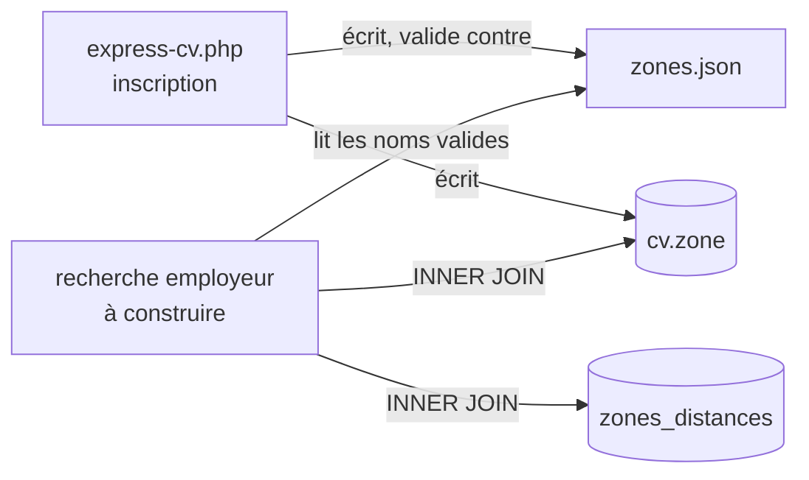

# Architecture Spine — cvmg-zone-express

## Design Paradigm

L'application ne suit aucun framework — une page PHP par route, PDO direct via `bdd()`, aucune couche d'abstraction. Deux catégories de données coexistent déjà et cette spine les prolonge :

- **Données de référence statiques** → fichier JSON plat, lu à la requête (`metiers.json`).
- **État qu'une requête SQL doit filtrer ou croiser avec d'autres critères** → colonne ou table SQL dédiée, même quand une copie existe aussi dans `donnees_json` pour le rendu (`titre`, `rayon_km`, `type`, `est_public`).

`zones_distances` est un cas particulier à nommer honnêtement : son contenu est statique (comme `metiers.json`), mais elle vit en SQL parce que `FR-1` doit la croiser dans une même requête avec métier, zone et seuil de densité — un fichier JSON obligerait à fractionner ce filtrage entre SQL et PHP. La raison du choix est la composabilité de la requête, pas la mutabilité de la donnée.

## Invariants & Rules



### AD-1 — `zone` est une colonne SQL dédiée, indépendante de `ville`

- **Binds:** FR-1, FR-3, FR-8, FR-9, FR-16, FR-18
- **Prevents:** la zone enfermée dans `donnees_json` où aucune requête SQL ne peut la filtrer ; la confusion entre `ville` (granularité ville, propre au CV complet, jamais renseignée côté Express) et `zone` (granularité quartier/sous-quartier, propre à la Voie Express).
- **Rule:** `cv.zone` est une colonne `VARCHAR(100)` dédiée, `NOT NULL` pour les lignes `type='express'` (cohérent avec `FR-18` : obligatoire à l'inscription), absente de sens pour les lignes `type='complet'`. Elle n'est jamais dérivée de, ni synchronisée avec, `donnees_json.personnel.ville`.

### AD-2 — [ADOPTED] La liste des zones valides suit le motif `metiers.json`

- **Binds:** FR-18 (capture à l'inscription), FR-1 (sélecteur employeur)
- **Prevents:** le formulaire d'inscription et le futur écran de recherche divergent sur ce qui compte comme une zone valide.
- **Rule:** un unique fichier JSON plat (`zones.json`, sibling de `metiers.json`) est la seule source des noms de zone valides. Les deux côtés (inscription et recherche) le lisent directement — aucune saisie libre, aucune duplication de liste.

### AD-3 — La distance entre deux zones vit dans une table SQL dédiée

- **Binds:** FR-1
- **Prevents:** la logique de correspondance géographique dupliquée entre PHP et SQL ; `FR-1` incapable de combiner métier + zone/distance + rayon + seuil de densité (`FR-8`/`FR-9`) en une seule requête.
- **Rule:** les distances entre paires de zones vivent dans une table `zones_distances` (`zone_depart`, `zone_arrivee`, `distance_km`). La recherche `FR-1` fait un `JOIN` SQL dessus ; elle ne charge jamais cette donnée en PHP pour la filtrer côté application.

### AD-4 — Intégrité des noms de zone entre les trois surfaces

- **Binds:** FR-1, FR-18
- **Prevents:** un nom de zone qui diverge d'un caractère (accent, casse, espace) entre `zones.json`, `cv.zone` et `zones_distances` — le `JOIN` de `FR-1` échouerait *silencieusement* (0 résultat, aucune erreur) plutôt que de signaler l'incohérence.
- **Rule:** `zones.json` est la liste canonique. Toute écriture dans `cv.zone` ou `zones_distances` (`zone_depart`/`zone_arrivee`) est validée par l'application contre cette liste avant insertion — une valeur absente de `zones.json` est rejetée, jamais insérée telle quelle. Les trois surfaces (`cv.zone`, `zones_distances.zone_depart`, `zones_distances.zone_arrivee`) utilisent la même collation explicite `utf8mb4_unicode_ci`, pour que la comparaison ne dépende jamais de la configuration par défaut du serveur.

### AD-5 — `zones_distances` stocke une matrice complète et symétrique

- **Binds:** FR-1
- **Prevents:** une recherche qui trouve un résultat dans un sens (zone A → zone B) mais pas dans l'autre (B → A) selon l'ordre des colonnes dans le `WHERE` ; une requête de jointure qui doit deviner le sens avec un `OR` ou `LEAST`/`GREATEST` plutôt que de lire directement.
- **Rule:** pour chaque paire de zones du quartier pilote, `zones_distances` contient **les deux lignes** (`A→B` et `B→A`, même valeur), plus une **ligne réflexive** par zone (`zone_depart = zone_arrivee`, `distance_km = 0`). La table est donc complète pour l'ensemble des zones de `zones.json` — pas de paire manquante. `FR-1` interroge avec un `INNER JOIN` simple, sans logique de symétrie côté requête ; une paire absente de la table est un défaut de données à corriger, pas un cas à tolérer silencieusement.

## Consistency Conventions

| Concern | Convention |
| --- | --- |
| Naming | `zone` (colonne), `zones_distances` (table), `zones.json` (fichier) — snake_case et français, cohérent avec `rayon_km`/`est_public`/`metiers.json` déjà en place. |
| Data & formats | `cv.zone` stocke le nom de zone en texte brut, validé contre `zones.json` (AD-4) — pas d'identifiant numérique. Pour les CV `type='express'` uniquement, `titre` stocke aussi le métier en texte brut tel quel (`enregistrer-express.php`) ; côté `type='complet'`, `titre` est un libellé composite avec repli (`enregistrer-cv.php`) — ne pas généraliser cette convention à `titre` hors du cas Express. |
| Collation | `utf8mb4_unicode_ci` explicite sur `cv.zone`, `zones_distances.zone_depart`, `zones_distances.zone_arrivee` (AD-4) — jamais la collation par défaut implicite du serveur. |
| État & session | Aucune divergence par rapport à `AGENTS.md` déjà en place (`bdd()` obligatoire pour tout accès SQL). |

## Structural Seed

```text
{project-root}/
  metiers.json                    # existant — liste normalisée des métiers
  zones.json                      # nouveau — liste normalisée des zones (sibling de metiers.json)
  ajouter_zone_cv.sql              # nouveau — ALTER TABLE cv ADD COLUMN zone
                                    #   (précédent : ajouter_colonnes_cv_express.sql,
                                    #    ajouter_est_operateur.sql — jamais éditer
                                    #    creer_table_cv.sql directement, une base déjà
                                    #    créée ignorerait la modification)
  creer_table_zones_distances.sql  # nouveau — table zone_depart/zone_arrivee/distance_km
```

## Capability → Architecture Map

| Capability / Area | Lives in | Governed by |
| --- | --- | --- |
| FR-18 (capture zone à l'inscription) | `express-cv.php`, `enregistrer-express.php` | AD-1, AD-2, AD-4 |
| FR-1 (recherche par métier + zone) | à construire | AD-1, AD-2, AD-3, AD-4, AD-5 |
| FR-3 (filtre par rayon) | à construire | AD-3, AD-5 |
| FR-8/FR-9 (garde-fou de densité) | à construire | AD-1 (compte sur `cv.zone` pour grouper par zone) — voir Deferred pour le stockage du seuil lui-même |
| FR-16 (statut de recherche visible travailleur) | à construire | AD-1 (lit `cv.zone` du travailleur pour signaler si sa zone reçoit des recherches) |

## Deferred

- **Contenu réel de `zones.json` et `zones_distances`** (noms des sous-zones, distances en km) — dépend de la question #1 du PRD (nom du quartier pilote et de ses sous-zones), non tranchée. Cette spine fixe la forme (AD-1 à AD-5), pas le contenu. Revisiter dès que #1 est réglée.
- **Où vit la valeur du seuil de densité (FR-8/FR-9)** — le PRD (question #2, déjà résolue) dit qu'aucune valeur n'est fixée avant simulation post-pilote sur 50-100 profils réels. Cette spine rend le comptage par zone possible (AD-1) mais ne fixe pas où stocker le seuil une fois connu (constante, config par zone) — à trancher quand la valeur existera.
- **Sens exact de « distance »** (à vol d'oiseau estimée, ou distance de marche/trajet réelle) — sans conséquence tant que le contenu n'existe pas.
- **Procédure si `zones.json` évolue** (renommage ou fusion d'une zone après que des profils existent déjà) — `cv.zone` et `zones_distances` sont des copies texte, non liées par clé étrangère ; un renommage non répercuté partout désynchronise silencieusement les trois surfaces malgré AD-4. Aucune procédure de migration n'est prévue ici — risque à surveiller si le pilote modifie sa liste de zones en cours de route, pas seulement avant son lancement.
- **Mécanisme d'accès à `zones.json` côté futur écran de recherche** (`include` PHP direct ou endpoint fetché en JS) — les deux produisent la même valeur, aucun risque de divergence de données ; laissé à la construction.
- **Évolution multi-quartiers ou multi-villes** au-delà de ce pilote (faut-il alors fusionner `zone` et `ville`, ou les garder séparés indéfiniment) — hors périmètre de cette spine, scopée à un seul quartier pilote.
